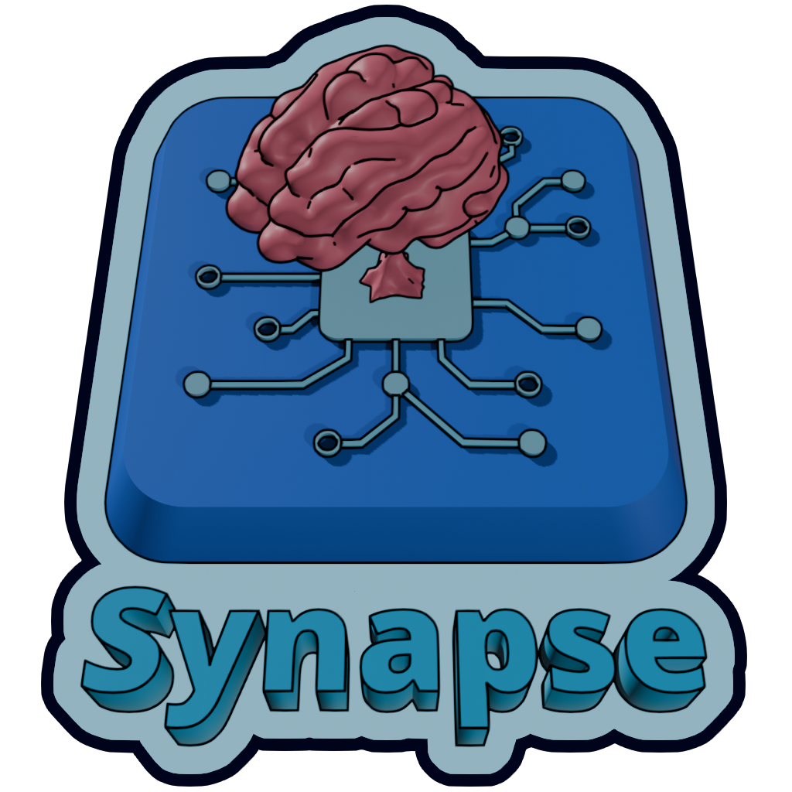

	

# Synapse
**An extensible state machine framework for Godot with a graph-based user interface.**

---

## ⚠️ Alpha Status and Versioning
Synapse is currently in **Alpha**. The API and data model are in active development and
**will change** before the 1.0 release.

* **Expect Breaking Changes:** Following [SemVer 2.0.0](https://semver.org/), while we are in
`0.x.y` versions, any minor version bump (e.g., `0.1` to `0.2`) should be considered potentially
backwards-incompatible.
* **Protect Your Work:** Always use version control (like Git). We cannot guarantee data migrations
between alpha versions.
* **Stay Updated:** Check the [CHANGELOG.md](docs/CHANGELOG.md) for upgrade instructions.

---

## ✨ Key Features
* **Graph-based UI:** Create and edit complex state transitions visually.
* **Composition-over-Inheritance:** Extensible behavior framework for adding logic to states.
* **Decoupled Logic:** Model state flow independently from the scene tree.
* **Visual Data Tracking:** Track how data and signals flow through your machine at a glance.
* **Blackboard System:** Share parameters easily between states and other game systems.
* **Built-in Persistence:** Native saving and loading support.
* **Nesting:** Sub-state machines for modular, reusable logic.

## 🚀 Getting Started
1. **Installation:** Copy the `addons/synapse` folder into your project's `addons/` directory.
2. **Enable:** Go to `Project -> Project Settings -> Plugins` and enable Synapse.
3. **Learn:** 
    - Familiarize yourself with the [Core Concepts](docs/concepts.md).
    - Follow the [Getting Started Guide](docs/getting_started/README.md).
    - Explore the heavily-commented [Demos](demos/README.md).

## 🗺️ Roadmap & Contributing
- **View the Full Roadmap:** [ROADMAP.md](docs/ROADMAP.md)
- **Report Problems:** Please report bugs or suggest features on the
[GitHub Issues page](https://github.com/gklompje/godot-synapse/issues).
- **Contribute:** See [CONTRIBUTING.md](docs/CONTRIBUTING.md) for contribution guidelines.

---

## Why Synapse?
Writing a simple state machine is easy; scaling one is hard. Synapse solves the common challenges of
visualization, data sharing, persistence, and modularity without forcing you to write boilerplate
code. It allows you to focus on game feel rather than control flow mechanics.

### What it is not
* **Not a Behavior Tree:** While you can build them here, it isn't optimized for task-priority
trees.
* **Not Visual Scripting:** It uses visual concepts for flow, but it is not a general-purpose
programming tool.

## ⚠️ Known Limitations
* **Node Hierarchy:** Moving or deleting Behavior nodes in the scene tree will currently break
references.
* **Duplication:** Duplicating a State Machine node in the same scene may cause data corruption.
* **Static Logic:** Adding states or behaviors at runtime is not yet supported.
* **Language:** Currently supports **GDScript only**.
* **Signals:** Does not yet support Callables with variadic or bound arguments.

---

## License & Attributions
Licensed under the [MIT License](LICENSE).

* **Godot Engine:** This project uses assets provided under the
[Godot MIT License](addons/synapse/licenses/GODOT_LICENSE.txt).
* **SemVer 2.0.0:** Authored by [Tom Preston-Werner](https://tom.preston-werner.com/), licensed
under [CC BY 3.0](https://creativecommons.org/licenses/by/3.0/).
