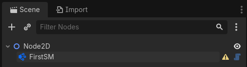
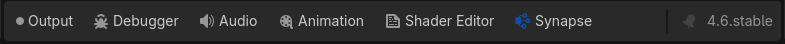
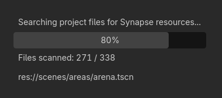
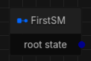
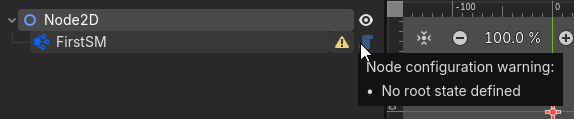
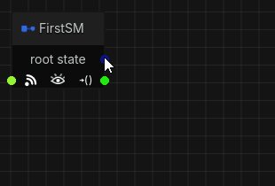
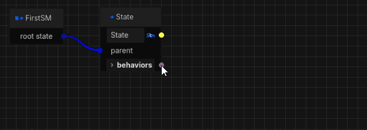
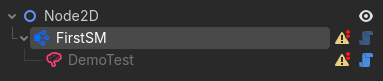
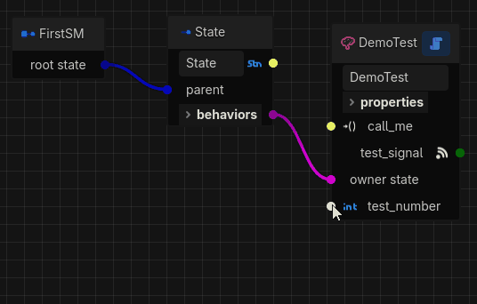

# Getting Started Part 1

## Scene Setup
The first thing we need to do is add a state machine node to a scene. For this guide we will just
create a new empty 2D scene to work with.

Next, we add a **SynapseStateMachine** node to the scene so we end up with:
<p align="center">
  
</p>

We just renamed our state machine to "FirstSM" because "SynapseStateMachine" is a bit long, but pick
any name you like. Next, if we select the state machine node in the scene tree we see a bottom panel
dock appear (if you want to see the icons, you can enable them in `Editor` → `Editor Settings...`
and then under the `Editor` section look for `Bottom Dock Tab Style`):
<p align="center">
   
</p>

The Synapse editor should open up automatically, but if it doesn't just click on the "Synapse"
bottom dock tab. When first enabling the plugin (and whenever Godot is started with it enabled), you
may be greeted with the below dialog in the dock:
<p align="center">
  
</p>

Upon loading up, Synapse searches through the current project's files looking for any scripts that
extend its functionality, such as custom states and behaviors. This should only take a few seconds
to complete and only happens on startup. Any new scripts and changes to existing scripts will be
picked up incrementally when you save a file.

Now that we have our basic scene set up, it's time to start building our state machine.

## Building a State Machine
When opening up the Synapse editor (bottom dock tab) for the first time on a state machine, we're
greeted with this lonely fellow:
<p align="center">
  
</p>

(The hieroglyphic-looking symbols below the "root state" label are for exposing signals and
callables in nested state machines, which we won't worry about in this guide.)

We call this graph node the "root sentinel" and it is always present in the editor. Unlike most
other things we'll see in the editor later on, this node doesn't have a runtime representation. It's
just a visual aid to point the state machine at its root state, since every state machine must have
a root. Before we add our root state, notice the warning icon next to our state machine node in the
scene tree. Hovering over it tells us that we need a root state, so we'll do that next:
<p align="center">
  
</p>

***Note:*** *It's always a good idea to address any state machine warnings. Most unresolved warnings
will cause the state machine to fail to initialize when we launch our game.*

### Adding a State
To add our first state, we just drag out a connection from the `root state` "port" on the root
sentinel and release it in any empty spot on the graph. Doing so will show a popup from where we can
select the type of state we want. Let's just pick "State" because it's the simplest state to get a
feel for the basics before moving to something fancier:
<p align="center">
  
</p>

"What if I messed up?", I hear you ask? No problem. This is probably a good time to mention that
almost anything you do in the editor can be undone (and redone) using the standard `Ctrl`+`Z` and
`Ctrl`+`Shift`+`Z` shortcuts (or `Cmd` if you're on a Mac). For example, if you picked the wrong
state type, go ahead and undo that. If you're really stuck, you have a number other options ranging
from surgical precision to apocalyptic (but all of these can be undone too!):
1. Select a node (or multiple, by holding `Ctrl` when selecting or dragging a box over them) and
press `Del` (no, you can't delete the root sentinel!).
1. Click the red trash can button in the graph's top control bar to erase everything.
1. In the Godot inspector, reset the `Data` property of the state machine node.
1. Delete the state machine node and create a new one.

By adding a root state we've resolved the warning, and our state machine is now ready for prime
time. Go ahead and run the scene to see what it does...

You should see... nothing. And that teaches us the first thing we need to know about states, which
is that they don't *do* anything by themselves. Their purpose is to model the control flow of our
state machine, **not** to implement any logic. We'll get to that in the next section, but let's
first take a closer look at the state node we just added.

The node has a title and an icon, which helps us identify the type of state. "State" is a terminal
(or leaf, if you prefer) state, so it can't have any child states.

Next, there's an editable text box where we can customize its name. You can call the state anything
you like, with the only restriction being that the name must be unique within this state machine. If
you try to set a duplicate name, the editor will append a number to keep it unique. Next to the name
you'll see a type icon (`StringName`, in this case) and a reference port. We'll use that later, but
for now just note that you can point other nodes at this port to reference the state's name, which
means you don't have to copy it in multiple places and risk things going wrong if you decide to
change it later.

Next, there's the "parent" port which connects back to the root sentinel, signifying that this state
is our root state. Connections in the editor generally follow the "left in, right out" order. We'll
refer to the connection points as input ports and output ports throughout this guide. Ports are
color coded to help identify their purpose, with connections typically going from darker to lighter
shades of the same color.

Next, there's an expandable "behaviors" slot showing the state's behaviors, which has an output port
where we can attach behaviors. It's empty right now, but we'll fix that in the next section.

Lastly, our state has two signal output ports. These offer a simpler alternative compared to adding
a behavior if all we want to do is trigger a callback on another entity when the state is entered or
exited.

OK, so now we have an idea of all the things a basic state provides. More importantly, we have a
state machine with some *structure* to which we can add *logic* using a behavior.

### Adding a Behavior
As you may have guessed, adding a behavior is just like adding a state. By dragging a connection
from the "behaviors" port, we can pick the behavior we want. Any custom behaviors you create will
also show up in this menu (more on that later). If you still have all the demos this menu will be a
bit crowded, but try and find the "DemoTest" behavior from the "Demos" category like so:
<p align="center">
  
</p>

If you glance back over to the scene tree, you will find a behavior node was added to the state
machine - Synapse will add and remove these behavior nodes as you add/remove them in the state
machine graph editor:
<p align="center">
  
</p>

You'll also notice we now have two new warnings to deal with. We'll address them as we go about
examining the layout of the behavior node. Just like the state node, the behavior node has an icon
and a type in the title plus an editable name, but there's also a script link button and an
"external link" icon in the title bar. Pressing the script button will open up the behavior's script
in the Godot editor, and pressing the external link button will select the behavior's node in the
scene tree.

Below that, there's an input called `call_me` and an output called `test_signal`. `call_me` is a
method to which we can connect signals, and `test_signal` is just a standard Godot signal that we
can connect to such methods on other nodes.

Next, there's the `owner state` input which identifies the state that owns this behavior. A behavior
can only have one owner. You may reassign the behavior to a different state by dragging this
connection to it, and doing so will remove the connection to the previous owner.

And finally, there's the `test_number` parameter with its type icon (`int`). A parameter is really
just a wrapper around a standard variable/property, but you can do a lot with it inside a state
machine.

Now, let's fix the first warning- the behavior doesn't have its "Test Name" property set. Select the
behavior by either selecting it from the scene tree or by pressing the external link button in its
title bar. Then let's set the property- I'm going with "my first behavior". Original.

To resolve the second warning, we need to assign a parameter to the behavior's `test_number` input.

### Adding a Parameter
By now you should know how to do this:
<p align="center">
  
</p>

Notice that we dragged it to the left this time, unlike when we added the state and the behavior.
That's because behaviors can provide hints telling the editor whether they write to, or only read
from, a given parameter. In this case, our behavior is saying it only reads from the parameter so
that's why it connects to an input port. Writeable parameters connect to output ports and have a
different colored connection.

Let's have a look at what our parameter has to offer. Again, it has an icon, a type, and an editable
name. And, like behaviors, we can open up its script. It also has a visibility toggle button that
you can press to make the parameter "public", but we won't use that feature in this guide.

Up next, the parameter has a `value` that has both a method input and a signal output. The method is
a setter for the value, and the signal is emitted whenever the value is set.

Lastly, there's a property editor where we can set the value - we're going with 42, but pick any
number you like. On either side of the value editor we can see the `int` reference ports, writable
on the left and read-only on the right connected to our behavior.

Also, now that we've resolved all our warnings (again) we can run the scene. This time, something
happens because now we have a behavior associated with our root state:
```text
DemoTest (test_name='my first behavior'): unsuspended with test_number=42
DemoTest (test_name='my first behavior'): test_number is now 42
```

Notice that it prints the "Test Name" property we set earlier, as well as the value we assigned to
the `test_number` parameter.

Now that we've built the equivalent of a "Hello, World!" of state machines, it's time to start
ramping up the sophistication. In the next part, we'll add more states so we can start modeling
some basic control flow, as well as a few more behaviors so they can start interacting with each
other. Grab your beverage of choice, then head over to
[Part 2: Adding More States](getting_started-2.md).

| [← Previous: Getting Started](README.md) | [Next: Part 2 →](getting_started-2.md) |
| :---: | ---: |
