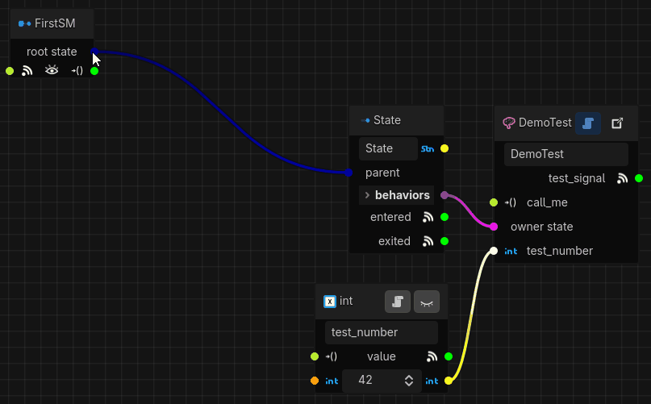
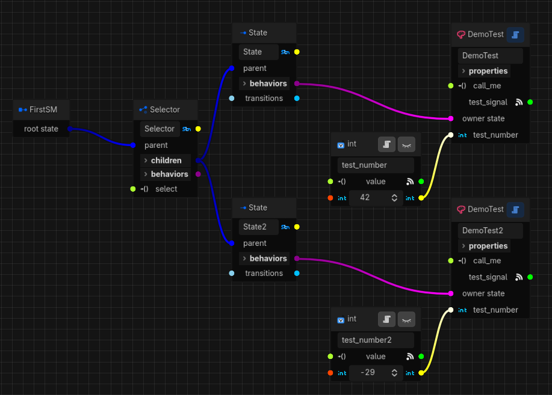
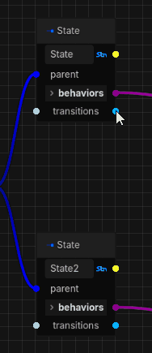

# Getting Started Part 2

## Adding More States
Right now our state machine only has a single state. Let's make it more interesting by adding a few
more. But, since we only have a "State" that can't have any child states, we'll need to introduce a
new state as the root.

Before we do, we probably want to create some space for it so let's move the root sentinel over to
the left a bit. We do that by left clicking anywhere on it and dragging.

Since our state machine is starting to expand, now's a good time to talk about navigating the graph:
* To pan around, hold down the middle mouse button or drag the view box in the bottom right minimap.
* To zoom in and out, use the scroll wheel or the `+` and `-` buttons in the top control bar.
* Since Godot 4.6 added floating docks, you can right-click on the bottom dock tab and select
"Make Floating" so you can optimize your screen layout or move it to a different screen if you have
one.

OK, back to adding a new root state. For this guide, we'll add a "Selector" by dragging it out from
the root sentinel and then assigning our current state as a child:
<p align="center">
  
</p>

A selector state can have any number of child states, but only one of them can be selected at a
time. While the selector state is active, its currently selected child is active and all its other
child states are inactive. When first loading up, the selector will select its first child. You can
re-order the child states in the foldable "children" container to change which state will be
selected first.

The selector has one extra port compared to the regular state, which is the `select()` method. We're
going to use that to tell the selector to select a different state, but first we need to add another
state. Let's do that now, and while we're at it give it its own DemoTest behavior and parameter.
We'll also set its "Test Name" property to "my second behavior" and give the parameter a value of
-29 (again, pick whatever you like). After tweaking the layout a bit, we end up with this:
<p align="center">
  
</p>

If we run our scene now nothing much will have changed, because the selector selects our first state
and then awaits further instructions, and we haven't given it any. Before we do, we have one final
piece to set up: transitions. Notice the new `transitions` ports that were added to our leaf states
when we parented them to the selector. A selector must be told which states can transition to each
other. For example, if we have a character that can be in an idle, walking, or running state but we
don't want to go straight from idle to running, only via walking and vice versa. In our case we want
to go either way, so let's add both transitions:
<p align="center">
  
</p>

To make our state machine come alive, we need to trigger the transitions we've set up. In the next
part of the guide we'll do that using signals, but just to see how it's done programmatically let's
add a script to our scene's root node and populate it with this (replace the node path with your
state machine node's and the state names if you changed them):
```gdscript
extends Node2D

@onready var first_sm: SynapseStateMachine = $FirstSM

func _ready() -> void:
	# the state machine emits "created" once it's fully initialized
	first_sm.created.connect(_on_first_sm_created)

func _on_first_sm_created() -> void:
	print("State machine created!")
	# we can find our selector state by its unique name in the "all_states" dictionary
	var selector_state := first_sm.all_states[&"Selector"] as SynapseSelectorState
	# trigger the transition from the initial state to "State2"
	selector_state.select(&"State2")
```

Running our scene now should give the following (with whatever values you set on the second behavior
and parameter):
```text
State machine created!
DemoTest (test_name='my second behavior'): unsuspended with test_number=-29
DemoTest (test_name='my second behavior'): test_number is now -29
```

Our first state is actually never entered here because the state machine's `created` signal is
emitted *before* the state machine activates, which means our signal handler ensures the second
state is the one that is entered when it does. For more control over the initialization, we can turn
off the "Activate on Create" property of the state machine in the inspector and trigger activation
manually. For example, if we do that and change our handler code to this:
```gdscript
func _on_first_sm_created() -> void:
	print("State machine created!")
	# first activate the state machine
	first_sm.activate()
	# we can find our selector state by its unique name in the "all_states" dictionary
	var selector_state := first_sm.all_states[&"Selector"] as SynapseSelectorState
	# trigger the transition from the initial state to "State2"
	selector_state.select(&"State2")
```

Then we should see that our first behavior is unsuspended, followed by being suspended during the
transition, and finally our second behavior is unsuspended:
```text
State machine created!
DemoTest (test_name='my first behavior'): unsuspended with test_number=42
DemoTest (test_name='my first behavior'): test_number is now 42
DemoTest (test_name='my first behavior'): suspended with test_number=42
DemoTest (test_name='my second behavior'): unsuspended with test_number=-29
DemoTest (test_name='my second behavior'): test_number is now -29
```

You can also access any parameter or behavior through the state machine's `all_behaviors` and
`all_parameters` dictionaries. Play around a bit if you like, and when you're ready make sure to
remove the script and re-enable "Activate on Create" so we can do all this using signals in
[Part 3: Signals](getting_started-3.md) - see you there!

| [← Previous: Part 1](getting_started-1.md) | [Home](README.md) | [Next: Part 3 →](getting_started-3.md) |
| :--- | :---: | ---: |
