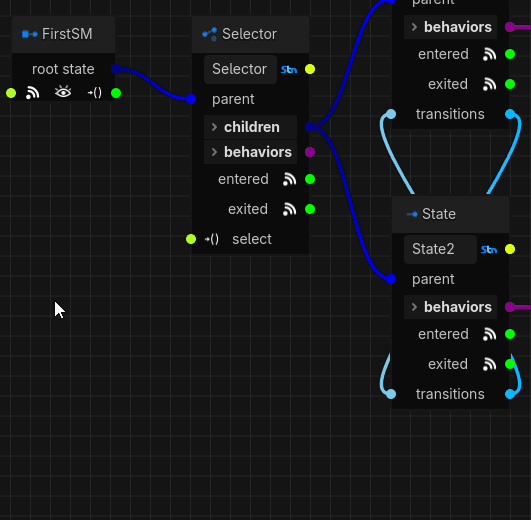
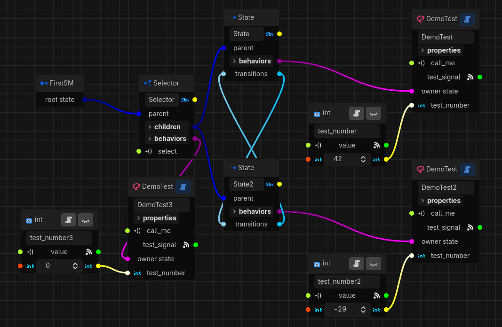
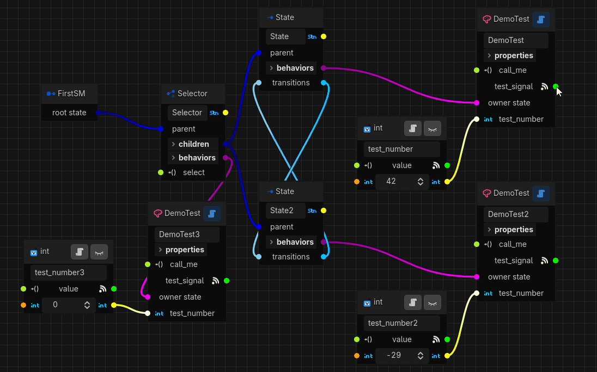
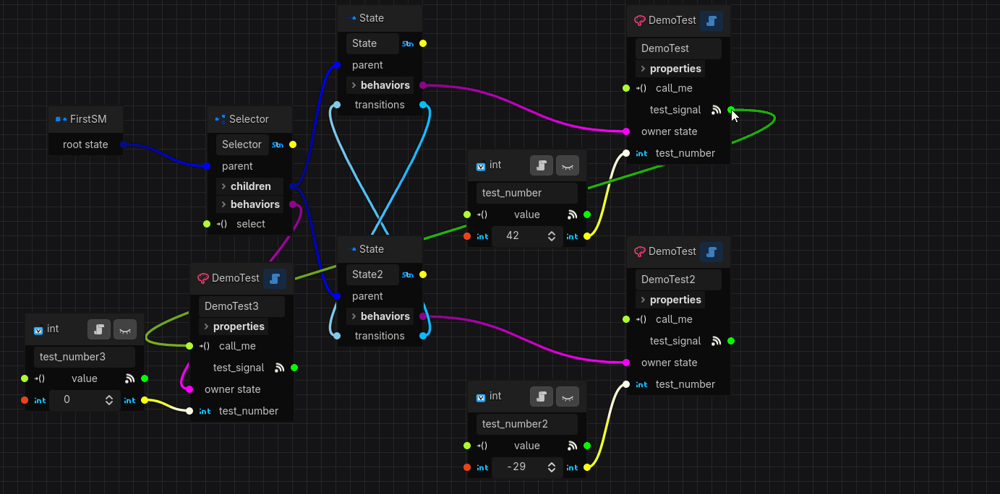
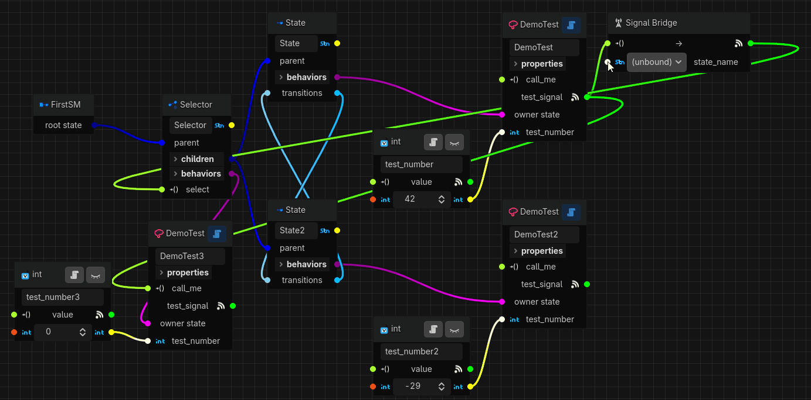

# Getting Started Part 3

## Signals
As you probably know, Godot's signals are one of its most powerful features and a great way to make
sure we minimize coupling between the various parts of our game. Synapse utilizes signals heavily,
and in this part of the guide we'll explore how you can make use of them.

To start with, we'll revisit our DemoTest behavior from previous parts of this guide. To demonstrate
a basic signal connection, we'll need two behaviors that are active at the same time. However, since
our state machine currently only has behaviors owned by two different states in a selector, they can
never be unsuspended together. Let's add a third behavior to our root state so it's always
unsuspended as long as our state machine is active. While you can drag out from the root state's
"behaviors" slot as before, there is another way to add things to our state machine- simply
right-click on an empty section of the graph:
<p align="center">
  
</p>

Dragging to create an entity will always create the connection for us, but when adding something
from the right-click menu we need to set up connections ourselves (most entity types will produce a
warning if they are left stranded without any connections). Now that we have our third behavior,
we'll give its "Test Name" property a value of "root", and assign its `test_number` parameter. Our
complete state machine now looks like this:
<p align="center">
  
</p>

### Connecting a Signal
Let's connect our first signal by dragging the `test_signal` output port of our first state's
behavior to the `call_me` port of our root state's behavior:
<p align="center">
  
</p>

Running our scene now gives:
```text
DemoTest (test_name='root'): unsuspended with test_number=0
DemoTest (test_name='root'): test_number is now 0
DemoTest (test_name='my first behavior'): unsuspended with test_number=42
DemoTest (test_name='my first behavior'): test_number is now 42
DemoTest (test_name='root'): signal relay called with signal_name='my first behavior' and signal_number=42
```

That last line appears only after a second or so. Notice that it prints the "Test Name" property and
`test_number` parameter value from our *first* state's behavior, not the root state's one. To see
what's happening here, and what this "signal relay" thing is it's talking about, let's open up the
DemoTest behavior's code in the editor by clicking the script icon on any of the behavior graph
nodes. Near the top we see the signal that is emitted by our first behavior:
```gdscript
# all signals expose an output port
signal test_signal(test_name: String, test_number: int)
```

Synapse exposes a signal port for each declared signal, so feel free to play around by adding more
signals. On the receiving side, signals can be connected to any public method (a method whose name
does not start with an underscore `_`):
```gdscript
# public methods expose input ports that signals can connect to
func call_me(signal_name: String, signal_number: int) -> void:
	print("DemoTest (test_name='", test_name, "'): signal relay called with signal_name='", signal_name, "' and signal_number=", signal_number)
```

Signal relays are just the mechanism by which behaviors connect signals to methods. Their main
purpose is to ensure that the signal handlers they point to are only called while the behavior is
unsuspended, to ensure that suspended behaviors don't take actions when we don't expect them to.
Signal relay *connectors* are a special type of signal relay that allows us to attach signals using
the graph editor. Above you can see how we defined the `call_me` public method that prints out the
current behavior's properties and the arguments the method was called with.

And finally, the behavior emits the `test_signal` method after a second's delay after it is
unsuspended (the delay isn't really necessary, it's just a safety mechanism to try and stop us from
from creating infinite loops while playing around with signals):
```gdscript
# called when this behavior is unsuspended
func _unsuspend() -> void:
	print("DemoTest (test_name='", test_name, "'): unsuspended with test_number=", test_number.value)
	await get_tree().create_timer(1.0).timeout
	test_signal.emit(test_name, test_number.value)
```

So, because of the connection we created the sequence of events is:
1. When our first state is activated and unsuspends its behavior, the behavior's `_unsuspend` method
calls the `test_signal` after a second's delay.
1. The signal is connected to the `call_me` relay connector on our root state's behavior, which is
already unsuspended because the root state is active and so the signal handler gets called.
1. The `_on_signal_relay_called` method is called with the arguments passed to it from the source
signal, which in this case are the values of the "Test Name" property and `test_number` parameter of
our first state's behavior, which is why we see those values printed out.

### Signal Bridge
If you paid close attention, you'll have noticed that the `test_signal` signal and
`_on_signal_relay_called` method have compatible signatures. Synapse compares these signatures when
connecting signals, and if they are compatible it just creates a direct connection. However, if we
try to connect a signal to a method with an incompatible signature, Synapse will create what's
called a "Signal Bridge". Let's create one by connecting the same signal on our first state to the
`select()` method of our root selector state. Because this method accepts only a single `StringName`
argument, Synapse creates a signal bridge so we can set up the arguments:
<p align="center">
  
</p>

***Note:*** *You can also forcibly create signal bridges between a compatible signal and method by
holding down `Ctrl`/`Cmd` while connecting them, if you want to customize the arguments.*

The signal bridge exposes all the arguments of its target method, and in our case we can see that
the selector state's `select()` method requires a `state_name: StringName` argument. There are two
ways to assign arguments in a signal bridge:
1. If there are any compatible arguments in the source signal, they will appear as drop-down options
below the default `(unbound)` option. In our case, the `test_name` argument of the signal is a
`String` and since `String` and `StringName` are compatible in Godot, we can select it from this
list. We call this "wiring" a signal argument to a callable argument.
1. The second option is to assign a value to the argument's input port from either a parameter's
value output or a property reference port like the name of a state. The argument port is only
available if the argument is unbound, i.e. it isn't already "wired" to a signal argument. You can
also just drag this port to an empty spot on the graph to create a new parameter, which is handy if
you want to just assign a constant, for example. When doing so, you may see a popup menu with
different parameter types, since Synapse will present you with all the parameters that have
compatible *value* types.

Selecting the `test_name` argument from the list and running the state machine will give us an error
because there is no state in the selector named "my first behavior" (the value of the "Test Name"
property on the first state). What we want is to tell our selector to select the second state, and
the best way to do that is to connect its name reference to the argument like so:
<p align="center">
  
</p>

Running our state machine now will result in:
```text
DemoTest (test_name='root'): unsuspended with test_number=0
DemoTest (test_name='root'): test_number is now 0
DemoTest (test_name='my first behavior'): unsuspended with test_number=42
DemoTest (test_name='my first behavior'): test_number is now 42
DemoTest (test_name='my first behavior'): suspended with test_number=42
DemoTest (test_name='my second behavior'): unsuspended with test_number=-29
DemoTest (test_name='my second behavior'): test_number is now -29
DemoTest (test_name='root'): signal relay called with signal_name='my first behavior' and signal_number=42
```

As we expect, we can see that our selector selects the second state after one second when the signal
is emitted, which calls the selector's `select()` method to trigger the transition!

One last thing to note about signal bridges is that their flexibility has a small performance cost,
and you should try to avoid over-using them in performance critical parts of your game. Under the
hood, signal bridges have to create intermediate (lambda) functions to be able to map different
combinations of signal arguments, references, parameter values, etc. to the target method's
arguments, all of which takes a few extra CPU cycles. That said, you should only ever notice this if
they are executed **a lot**. It's generally better to connect compatible signals/methods, but you
also shouldn't try to optimize prematurely.

### Disconnecting
At this point we've created many connections of various types in our state machine, including state
parent/child relationships, state/behavior ownership, parameter assignments, signals and signal
arguments, etc. If you want to break a connection, just hold down the `Alt` (`Option` on Mac) key
and hover over a connection. You will see an `X` button that you can click to delete the connection. 
Note that when deleting connections to or from signal bridges, the whole signal bridge will be
deleted because a signal bridge is a one-to-one connection between a particular signal and method.

### Conclusion
This guide has given you an overview of all the building blocks Synapse offers for creating powerful
and dynamic state machines. To realize their full potential in your game, you will want to create
your own behaviors and probably also some parameters for any custom types your game uses. For
maximum control over the state machine's flow, you can even create your own state types. We've
reached the end of this guide, but you can head over to the [Tutorials](../tutorials/README.md)
section to learn about customization, or browse the [Demos](../../demos/README.md) to see some
example state machines. For deep dives on the components we've used, you can go read the
[Manual](../manual/README.md) or read the class documentation in the Godot editor.

| [← Previous: Part 2](getting_started-2.md) | [Home](README.md) | [Back to Documentation →](../README.md) |
| :--- | :---: | ---: |
