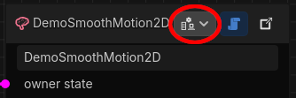
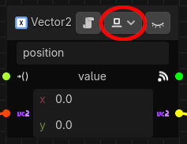

# Multiplayer State Machines

## Overview
A Synapse state machine can contain an arbitrary number of states, behaviors, parameters, etc. When
building a multiplayer game, you want to control how each component behaves depending on which
multiplayer peer it is running in.

In order to understand how Synapse state machines handle multiplayer synchronization, you must first
understand the basics about Godot's multiplayer support, which you can find in the project's
[Networking](https://docs.godotengine.org/en/stable/tutorials/networking/index.html) documentation.
In particular, you need to understand the difference between the high-level and low-level APIs
because you will need to choose which one Synapse uses.

## Prerequisites
When designing a multiplayer state machine, you will need to decide how you want to organize your
game. In particular, you need to choose whether you follow a server/client model and decide which
peer is authoritative for a given state machine. With that in mind, Synapse multiplayer support is
built around each state machine being able to identify:
1. Whether it is running on the *server* ([`MultiplayerAPI.is_server()`](https://docs.godotengine.org/en/stable/classes/class_multiplayerapi.html#class-multiplayerapi-method-is-server)), and
2. Whether it is running on the peer that is authoritative for the state machine node ([`Node.is_multiplayer_authority()`](https://docs.godotengine.org/en/stable/classes/class_node.html#class-node-method-is-multiplayer-authority))

The above applies irrespective of which multiplayer API you use. When using a custom low-level API,
you must still ensure that the state machine's `multiplayer.is_server()` and
`is_multiplayer_authority()` methods return the appropriate values (clients also assume that the
peer with ID=1 is the server when receiving RPC messages from peers).

Synapse multiplayer support is configured *at the state machine level*. This means that each
individual state machine is responsible for synchronizing all of its contained entities with its
equivalent state machine across multiplayer peers. You do this by setting the **Multiplayer Mode**
property of the state machine to one of the two API modes, i.e. not **Disabled** (more on the modes
in [High-level vs. Low-level](#high-level-vs-low-level)).

## What Synapse Provides
There are two key aspects that drive how a state machine behaves in a multiplayer environment:
1. [Behavior execution](#behavior-execution-modes): You will want Certain behaviors to only execute
on some peers, for example an input handling behavior for controlling a specific player's character.
2. [Parameter replication](#parameter-replication-modes): In many cases you want to share things
like a character's position with other peers, which requires replicating the parameter's value
across the network.

Synapse does **not** handle the spawning of state machines across the network.

### Behavior Execution Modes
Behaviors will execute on all multiplayer peers by default, but you can choose to restrict execution
of any given behavior based on which multiplayer peer it is running in.

Each behavior has a **multiplayer execution** parameter that you can set via the inspector or
directly on the behavior node in the Synapse editor (if you don't see the widget, make sure you set
a multiplayer mode on your state machine per the [Prerequisites](#prerequisites)):

  

The options are as follows:
<table>
	<thead>
		<tr>
	  <th colspan="2">Mode</th>
			<th>Peer type</th>
			<th>Authority?</th>
			<th>Executes</th>
		</tr>
	</thead>
	<tbody>
		<tr>
			<td>
				
				
			</td>
			<td><code>EVERYONE</code></td>
			<td align="center" align="center">n/a</td>
			<td align="center" align="center">n/a</td>
			<td align="center">✅</td>
		</tr>
		<tr>
			<td rowspan="2">
				
				
			</td>
			<td rowspan="2"><code>AUTHORITY_ONLY</code></td>
			<td rowspan="2" align="center">n/a</td>
			<td align="center">✅</td>
			<td align="center">✅</td>
		</tr>
		<tr>
			<td align="center">❌</td>
			<td align="center">❌</td>
		</tr>
		<tr>
			<td rowspan="2">
				
				
			</td>
			<td rowspan="2"><code>NON_AUTH_ONLY</code></td>
			<td rowspan="2" align="center">n/a</td>
			<td align="center">✅</td>
			<td align="center">❌</td>
		</tr>
		<tr>
			<td align="center">❌</td>
			<td align="center">✅</td>
		</tr>
		<tr>
			<td rowspan="2">
				
				
			</td>
			<td rowspan="2"><code>SERVER_ONLY</code></td>
			<td align="center">server</td>
			<td rowspan="2" align="center">n/a</td>
			<td align="center">✅</td>
		</tr>
		<tr>
			<td align="center">client</td>
			<td align="center">❌</td>
		</tr>
		<tr>
			<td rowspan="2">
				
				
			</td>
			<td rowspan="2"><code>CLIENTS_ONLY</code></td>
			<td align="center">server</td>
			<td rowspan="2" align="center">n/a</td>
			<td align="center">❌</td>
		</tr>
		<tr>
			<td align="center">client</td>
			<td align="center">✅</td>
		</tr>
		<tr>
			<td rowspan="3">
				
				
			</td>
			<td rowspan="3"><code>PROXIES_ONLY</code></td>
			<td align="center">server</td>
			<td align="center">n/a</td>
			<td align="center">❌</td>
		</tr>
		<tr>
			<td rowspan="2" align="center">client</td>
			<td align="center">✅</td>
			<td align="center">❌</td>
		</tr>
		<tr>
			<td align="center">❌</td>
			<td align="center">✅</td>
		</tr>
	</tbody>
</table>

### Parameter Replication Modes
Parameters are **not** shared across multiplayer peers by default, meaning each peer has its own
value for the parameter that is independent of other peers.

In a multiplayer environment you want some peers to be responsible for updating a parameter and have
those updates reflected on other peers. For example, when the server updates player scores or when a
player updates their character's position. You can do this from the Synapse editor (if you don't see
the widget, make sure you set a multiplayer mode on your state machine per the
[Prerequisites](#prerequisites)):

  

The options are as follows:
<table>
	<thead>
		<tr>
	  <th colspan="2">Mode</th>
			<th>Peer type</th>
			<th>Authority?</th>
			<th>Replicated</th>
		</tr>
	</thead>
	<tbody>
		<tr>
			<td>
				
				
			</td>
			<td><code>LOCAL</code></td>
			<td align="center" align="center">n/a</td>
			<td align="center" align="center">n/a</td>
			<td align="center">❌</td>
		</tr>
		<tr>
			<td rowspan="2">
				
				
			</td>
			<td rowspan="2"><code>SERVER_AUTH</code></td>
			<td align="center">server</td>
			<td rowspan="2" align="center">n/a</td>
			<td align="center">✅</td>
		</tr>
		<tr>
			<td align="center">client</td>
			<td align="center">❌</td>
		</tr>
		<tr>
			<td rowspan="2">
				
				
			</td>
			<td rowspan="2"><code>CLIENT_AUTH</code></td>
			<td align="center">server</td>
			<td rowspan="2" align="center">n/a</td>
			<td align="center">❌</td>
		</tr>
		<tr>
			<td align="center">client</td>
			<td align="center">✅</td>
		</tr>
		<tr>
			<td rowspan="2">
				
				
			</td>
			<td rowspan="2"><code>CLIENT_PREDICTED</code></td>
			<td align="center">server</td>
			<td rowspan="2" align="center">n/a</td>
			<td align="center">❌*</td>
		</tr>
		<tr>
			<td align="center">client</td>
			<td align="center">✅*</td>
		</tr>
	</tbody>
</table>

\* 🚧 Coming soon! 🚧 TODO: Validation

## High-level vs. Low-level
If you're already familiar with Godot multiplayer support, you'll know which side of this fence your
project is on. If not, it is recommended that you use the high-level API because it abstracts away
a lot of the complexity of multiplayer synchronization, at the cost of being less flexible and more
opinionated about the implementation.

### Using the High-level API
*It is highly recommended that you read Godot's
[High-level multiplayer](https://docs.godotengine.org/en/stable/tutorials/networking/high_level_multiplayer.html)
documentation as this section assumes familiarity with it.*

When you select "High Level" as the state machine's multiplayer mode in the inspector, the state
machine will do all the work of synchronizing with peers for you using Godo't built-in RPC
mechanisms, which are subject to the following:
1. Your code is reponsible for setting up connections between peers such that the state machine
node's `multiplayer` property refers to an active connection for the state machine to synchronize
(the connection doesn't have to be active at the time of the state machine's initialization- it will
wait to start synchronizing until the connection becomes active).
1. The state machine's multiplayer peer must be set up to receive RPC methods. This is usually
accomplished by ensuring the scene tree is identical in all connected peers, but Godot does allow
for some customization of the "root path" (see the multiplayer demo's
[Asymmetric Scenes](../../demos/multiplayer/README.md#-asymmetric-scenes) note).
1. The previous point also applies when dynamically adding state machines (e.g. when spawning
characters that have state machines in your game). The easiest way to achieve this is to use Godot's
`MultiplayerSpawner` and remembering to call `set_multiplayer_authority` on the spawned scenes.

While in this mode, state machines running on non-server peers will send their updates to the server
where the update is validated before being broadcast to other peers. This doesn't necessarily force
you to use a client/server multiplayer architecture (as opposed to a peer-to-peer mesh), but when
choosing a different architecture you need to consider how that affects the parameter replication
and behavior execution modes, as outlined in the tables above.

🚧 Coming soon! 🚧

### Using the Low-level API

🚧 Coming soon! 🚧

| [← Previous: Working with Signals](signals.md) | [Manual](README.md) |
| :--- | ---: |
