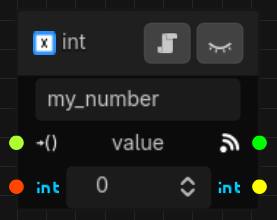

# Working with Parameters
A parameter is really just a wrapper around an arbitrary value. By wrapping your game objects in
parameters, you can use them in a variety of ways in your state machine, and even elsewhere in your
game.

## Adding a Parameter to a State Machine
There are a variety of ways to add parameters to your state machine, but most of them involve simply
dragging a connection out from a port on another node that takes a parameter reference, for example
an exported parameter property of a behavior. What you'll see in the editor is this:
<p align="center">
  
</p>

There is one nuance, though- When creating a parameter by dragging from a behavior (or a nested
state machine), Synapse will look for compatible `SynapseParameter` *classes*. If only one is found
it will just create the parameter, but if more than one implementation exists (i.e. a parameter
class extending another parameter class) a popup will appear for you to select from. In contrast,
when assigning parameters as arguments to a signal bridge, Synapse will look for compatible
parameters based on their *value type*. For example, since `String` is compatible with `StringName`
in Godot, both options are valid.

Like other state machine entities, each parameter has a unique name within the state machine that
you can customize if you like. You can also toggle its visibility by pressing the eye button in the
title bar. Making a parameter visible this way has two side-effects:
1. It allows the parameter's value to be set in the state machine node's inspector (under the
"Parameters" group).
1. It allows the parameter to be overridden when its containing state machine is nested within
another state machine.

Parameters are hidden by default since most of the time they are used to pass changing values
between behaviors etc., and a typical state machine will contain quite a few of them which would
unnecessarily clog up the inspector. You can think of visible parameters as public properties of the
state machine itself, to be used from "the outside".

The signal ports are just a setter for the value on the left, and a signal that fires when the
parameter's value is set on the right. You can use these as triggers in your state machine.

On either side of the value editor are the writer and reader ports. Like their equivalent ports on
behaviors and nested state machines, these are *simply a visual aid* (Try this: update a behavior's
`_get_read_only_parameters()` to mark the parameter as read-only or writable- you should see the
graph update accordingly).

### Parameters in Nested State Machines
When one state machine (let's call it the child) is added to another state machine (the parent) and
a visible/public parameter of the child is connected in the parent state machine, a *new parameter
instance* is created in the parent state machine. Only the initial value is copied from the child
state machine's parameter, but otherwise the parent state machine's parameter is a completely
different resource. When the child state machine loads up at runtime, the parent will substitute the
child state machine's parameter with its own (the parent's) parameter.

## How Parameters are Stored
When you set the parameter's value in the editor (or in the state machine node's inspector if it's
public), Synapse stores this value inside the parameter resource that is housed inside the state
machine's `data` resource. However, the state machine first has to finish initializing itself before
the parameters and their values can be reliably accessed. In practice, you should wait for the state
machine's `created` signal before reading any state machine parameter's value from elsewhere in your
code. For example, behavior nodes can be ready before their containing state machine depending on
their relative positions in the scene tree, so a behavior should also not try to read parameter
values in its `_ready()` method (use the `_state_machine_created()` method instead).

### Working with Node Paths
`NodePath` values stored in parameters are always relative to the parameter's state machine. This is
because parameters aren't nodes themselves, so paths can't be resolved directly from the parameter.
This is important to consider when behaviors interact with node path parameters. Because behaviors
are nodes themselves, a typical mistake is to do something like this in a behavior's code:
```gdscript
get_node(parameter.value) # wrong!
parameter.value = get_path_to(node) # wrong!
```

But, those methods resolve paths *relative to the node they're called on* (i.e. the behavior node),
meaning that the paths will mean different things when accessed from different places (like
two different behaviors referencing the same parameter, for example). The correct way to handle node
paths from a behavior or elsewhere in your code is:
```gdscript
state_machine.get_node(parameter.value) # right!
parameter.value = state_machine.get_path_to(node) # right!
```

(Behaviors have a property called `state_machine` that points to their owning state machine at
runtime, for just this kind of thing.)

| [Manual](README.md) | [Next: Working with Behaviors →](behaviors.md) |
| :--- | ---: |
