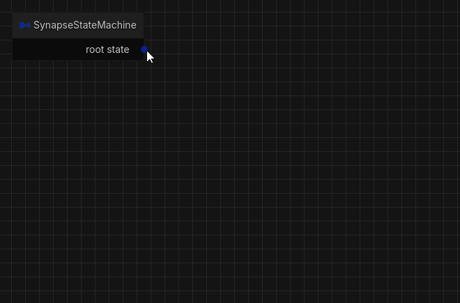
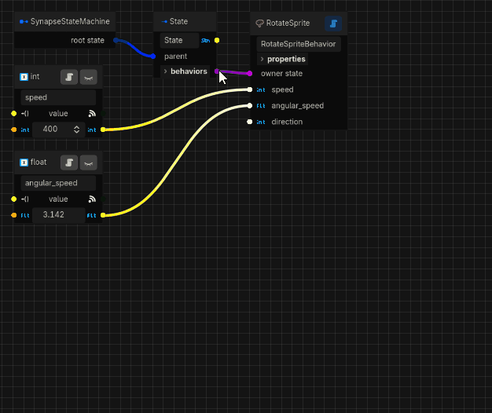
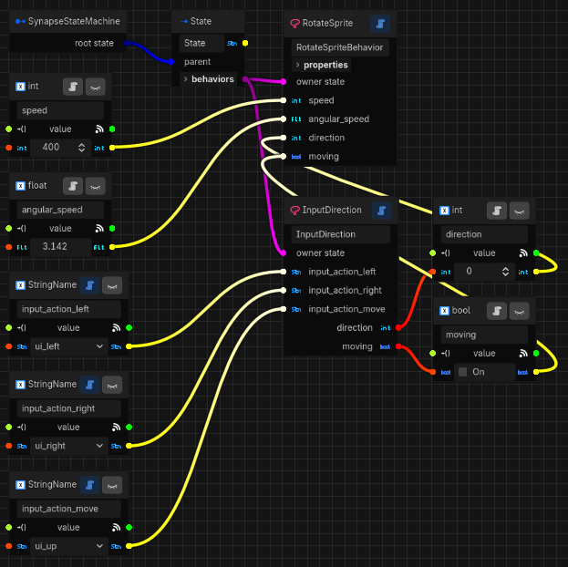
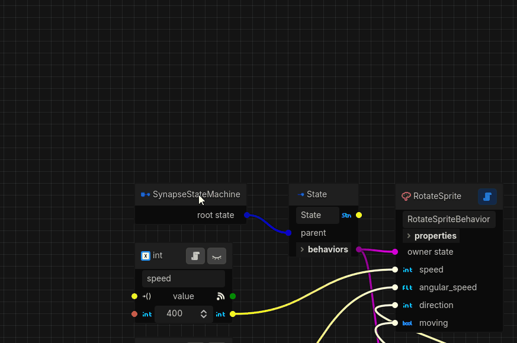
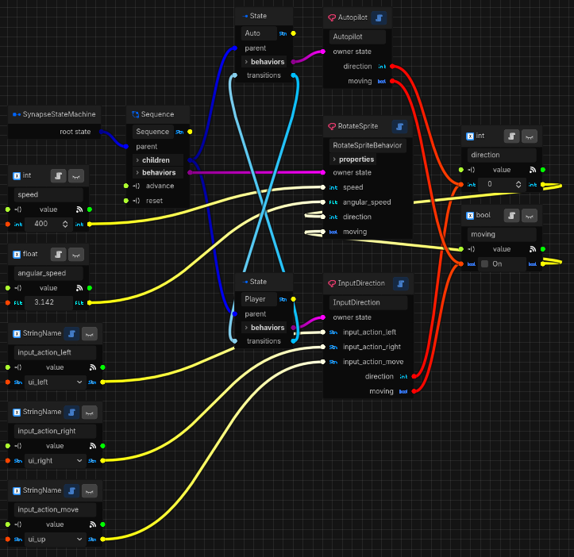
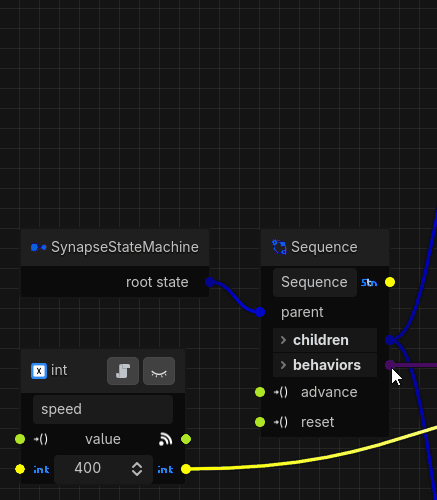

# Tutorial: Creating Custom Behaviors
Custom behaviors are at the heart of what makes a state machine implement, and interact with, your
game. Don't be surprized if you end up creating dozens of them or more!

To create a custom behavior, all you have to do is create a script that satisfied the following
minimum requirements:
1. The script must have a global `class_name`.
1. The script must inherit from `SynapseBehavior` (directly or indirectly).
1. The script must be annotated with `@tool` (without this, Synapse will not be able to call its
methods from the Godot editor to figure out how to model it in the state machine graph editor).

## Step by Step
Instead of trying to make a generic behavior that can do everything, we're going to implement
behaviors that loosely follow the instructions from Godot's
[Step by Step](https://docs.godotengine.org/en/stable/getting_started/step_by_step/index.html)
guide. Go ahead and set up the `Sprite2D` scene from the first section of that guide but stop before
attaching a script to the `Sprite2D` node. We're going to do that differently.

### Behavior 1: Rotating the Sprite
Create a standalone behavior script called `rotate_sprite.gd` populate it with the following:
```gdscript
@tool
class_name RotateSpriteBehavior
extends SynapseBehavior

@export var sprite: Sprite2D
@export var speed: SynapseIntParameter
@export var angular_speed: SynapseFloatParameter

# not necessary, but keeps the state machine editor organized
static func get_category() -> StringName:
	return &"Tutorials"

# visual hint to indicate we won't be writing to these parameters
func  _get_read_only_parameters() -> PackedStringArray:
	return ["speed", "angular_speed"]

func _process(delta: float) -> void:
	sprite.rotation += angular_speed.value * delta
	var velocity := Vector2.UP.rotated(sprite.rotation) * speed.value
	sprite.position += velocity * delta
```

In addition to satisfying the requirements mentioned earlier, the main differences between this
behavior script and the one from the Godot guide are:
1. Since our script isn't attached to the `Sprite2D` node, it needs to be given a reference to the
sprite node in the form of the exported `sprite` variable.
1. We chose to model the `speed` and `angular_speed` values as parameters. This isn't strictly
necessary, but it allows us to model these values within the state machine. Doing this also means we
have to use `.value` inside the rotation calculations.

***Note:*** *When working with tool scripts, we need to be careful about methods that Godot will run
inside the editor like `_process()` and `_physics_process()`. When behavior nodes initialize they
set their `process_mode` to `PROCESS_MODE_DISABLED` which covers most cases, but it's never a bad
idea to add safeguards like this for code we don't want running inside the Godot editor:*
```gdscript
func _process(delta: float) -> void:
	if Engine.is_editor_hint():
		# since this is a tool script, we don't want this method to run in the editor!
		return

	# ... (runtime code here)
```

Now, let's add a node to our scene with this behavior script (by pressing `Ctrl`/`Cmd`+`A` and
selecting `RotateSpriteBehavior`). Then, select this node and assign the sprite node reference using
the inspector.

If we run the scene at this point our behavior won't do anything because it isn't a part of a state
machine. But, ultimately we'll be adding this scene to another scene as per the Godot guide. Since
we want to test our behavior now, let's skip ahead in the Godot guide a bit and create that scene
before continuing on.

### Scene Setup
Create a new 2D scene and add the `sprite_2d.tscn` scene to it as a child (with
`Ctrl`/`Cmd`+`Shift`+`A`). Then, add a `SynapseStateMachine` (`Ctrl`/`Cmd`+`A`) node to it and open
up the Synapse state machine editor by selecting it in the bottom dock. For now we'll just add a
single state to own our behavior, like so:
<p align="center">
  
</p>

If you set everything set up correctly, running the `node_2d.tscn` scene should result in the icon
rotating just like in the Godot guide!

### Behavior 2: Handling Input
If we were following the Godot guide closely, we would next update the above behavior with input
handling as per the second part of the Godot guide. However, we want to learn some good habits and
one of the best programming habits is to separate concerns. In this scenario, that means creating a
different behavior to deal with player input. The only thing our first behavior needs is a direction
value, so let's add a new read-only parameter for that and include it in the calculation:
```gdscript
@export var direction: SynapseIntParameter

func  _get_read_only_parameters() -> PackedStringArray:
	return ["speed", "angular_speed", "direction"] # add direction

func _process(delta: float) -> void:
	sprite.rotation += angular_speed.value * direction.value * delta
	# ...
```

(There are, of course, better ways to model a direction like using an enum or a custom parameter
that restricts the values, but we'll follow the guide to keep things simple here.)

Next we'll add a second behavior to handle inputs. We'll call it `input_direction.gd`:
```gdscript
@tool
class_name InputDirection
extends SynapseBehavior

@export var input_action_left: SynapseInputActionParameter
@export var input_action_right: SynapseInputActionParameter
@export var direction: SynapseIntParameter

static func get_category() -> StringName:
	return &"Tutorials"

func _get_read_only_parameters() -> PackedStringArray:
	return ["input_action_left", "input_action_right"]

func _process(_delta: float) -> void:
	direction.value = 0
	if input_action_left.is_pressed():
		direction.value = -1
	if input_action_right.is_pressed():
		direction.value = 1
```

Again, some noteworthy differences from the Godot guide:
1. We use `SynapseInputActionParameter` because it's a convenient way to deal with input actions,
but we could have modeled the actions using `SynapseStringParameter`, for example.
1. We only mark the input parameters as read-only, since we'll be writing to the direction value.

Next up, let's update our state machine in `node_2d.tscn` like so:
<p align="center">
  
</p>

If you run the scene again, you should now be able to control the icon using the left and right
arrow keys, but you may have to be quick about it since the icon will start moving up and out of the
screen as soon as the scene finishes loading!

### Controlling Movement
Following the Godot guide, let's make it so the icon only moves while we're holding the up arrow
key. Open up the first (rotation) behavior (shortcut: click on its script icon in the state machine
editor). Then add a `SynapseBoolParameter` to determine whether or not the icon should be moving:
```gdscript
@export var moving: SynapseBoolParameter

func  _get_read_only_parameters() -> PackedStringArray:
	return ["speed", "angular_speed", "direction", "moving"] # add moving

func _process(delta: float) -> void:
	sprite.rotation += angular_speed.value * direction.value * delta
	var velocity := Vector2.ZERO
	if moving.value:
		velocity = Vector2.UP.rotated(sprite.rotation) * speed.value
	sprite.position += velocity * delta
```

Now, in our second (input handler) behavior let's add two more parameters, one for the input and one
to update the `moving` parameter based on whether or not the input is pressed:
```gdscript
class_name InputDirection

# ...

@export var input_action_move: SynapseInputActionParameter
@export var moving: SynapseBoolParameter

func _get_read_only_parameters() -> PackedStringArray:
	return ["input_action_left", "input_action_right", "input_action_move"] # add input_action_move

func _process(_delta: float) -> void:
	# ...
	moving.value = input_action_move.is_pressed()
```

Lastly, update the state machine to look something like this:
<p align="center">
  
</p>

Running the scene now should allow you to control the movement using the up arrow key. Next up-
signals!

## Adding Signals
In this section, we'll deviate a bit from the Godot guide. If we followed that guide, we'd end up
connecting a button to a method on the script that toggles its `processing` property. But, behaviors
already have that functionality built in, and it's meant to be triggered when a behavior's owner
state is entered and exited. So, let's use signals to manage these state transitions instead.

Also, since we've nicely separated concerns so far we don't have to create a new scene at all- we'll
just add to our `node_2d.tscn` scene. To start off, add a button to the scene as per the Godot
guide, but don't connect the signals in the inspector. Before we deal with signals, let's update our
state machine so it's able to switch between player controlled and automatic motion. Like this:
<p align="center">
  
</p>

Let's break it down:
1. We moved the root sentinel to open up some space. Purely aesthetic.
1. Then we added a new root node, this time a Sequence state. Sequences are a good fit here because
we don't need to create transitions manually or select specific state names like we would need to
with a Selector - sequences just run in a loop.
1. Lastly, we re-assign the rotator behavior to our new root state. That's because we always want
the motion to occur, with our child states controlling the parameters that influence *how* motion is
applied.

***Note:*** *Sequence state ordering is based on the order in which the child states are added. By
connecting our previous state (the one containing the input handling behavior) first, we made it so
the state machine starts as player controlled. To change the order, you can open the "children"
foldable container of the sequence state and press the up or down arrow buttons next to a state.*

Now we need a behavior to go with our second state.

### Behavior 3: Autopilot
Remember at the beginning of the guide, when the icon moved clockwise by itself? To do that without
altering our rotator behavior, all we need to do is set the `direction` parameter to `1`, and the
`moving` parameter to `true`. Since we'll be doing this in a sequence state that is a sibling of our
player controlled state, we don't have to worry about the input handling behavior and the
"autopilot" behavior conflicting with each other. Let's create a new behavior script called
`autopilot.gd`:
```gdscript
@tool
class_name Autopilot
extends SynapseBehavior

@export var direction: SynapseIntParameter
@export var moving: SynapseBoolParameter

static func get_category() -> StringName:
	return &"Tutorials"

func _unsuspend() -> void:
	direction.value = 1
	moving.value = true

func _suspend() -> void:
	direction.value = 0
	moving.value = false
```

All this behavior does is set the `direction` and `moving` parameter values to enable and disable
motion based on whether or not it is unsuspended. The `_unsuspend()` and `_suspend()` methods are
called by the state machine whenever a behavior's owner state is entered and exited, respectively.
Now go ahead and add this behavior to the second state, and make it write to the `direction` and
`moving` parameters we added earlier. Your state machine might be getting a bit crowded, so you
should rearrange the nodes in a way that makes sense to you. We went with this (we also renamed the
states so it's easier to see which is which):
<p align="center">
  
</p>

You can test the new behavior by changing the sequence (root state) child order so our autopilot
state is first if you like. Our final task is to use signals to switch between the two states. Of
course, we need another behavior!

### Behavior 4: Advancing the Sequence
What we want is a behavior that responds to the button press, then triggers the sequence state's
`advance()` method. Let's create a behavior that holds a reference to the button. We're calling it
`advance_on_button_press.gd`:
```gdscript
@tool
class_name AdvanceOnButtonPress
extends SynapseBehavior

signal button_pressed

@export var button: Button

static func get_category() -> StringName:
	return &"Tutorials"

# connects to the button's "pressed" signal, but only while this behavior is unsuspended
func _get_signal_relays() -> Array[RuntimeSignalRelay]:
	return [
		# emit our "button_pressed" signal when the button is pressed
		SignalRelay.of(button.pressed, button_pressed.emit)
	]
```

This behavior mainly acts as a proxy for the button's own `pressed` signal. It also ensures that we
follow the intuitive number one rule of states, which is that an inactive state shouldn't do
*anything* (including responding to signals!). Signal relays are just a fancy way of ensuring that
signal handler methods are only called when the behavior is unsuspended. Much easier than checking
`if is_suspended()` everywhere!

Finally, add the behavior to the sequence state and connect the behavior's `button_pressed` signal
to the sequence state's `advance()` method:
<p align="center">
  
</p>

Remember to assign the `button` property of the behavior so it references the button node in the
scene. When you're done, pressing the "Toggle motion" button should toggle between our autopilot and
player controlled states and their associated behaviors.

## Conclusion
In this guide we saw how to use behaviors to modularize functionality, and to associate their
functionality with specific state machine states. We also learned quite a bit about what we can do
with behaviors, including:
* Triggering logic when they (un)suspend,
* Using parameters to share data between behaviors,
* Using signals to trigger state machine transitions,

... and more. While these building blocks will serve you well when creating your own behaviors,
there's more to discover. The best place to learn about them is the `SynapseBehavior` class
documentation.

Hopefully you enjoyed following this guide as much as we did making it! If you did, there's one more
task "left as exercise for the reader": The Godot guide includes a final section that uses a timer
to make the icon flicker. Armed with your new knowledge about behaviors, you should be able to model
that as a behavior without breaking a sweat. The real question is, do you want to add it to an
existing state, or add another sequence state, or do you want modify the state machine so the
flicker effect can run simultaneously with our existing motion states (hint: combiner states are
great for that)? It's up to you now...

| [← Previous: Creating Custom Parameters](custom_parameters.md) | [Tutorials](README.md) | [Next: Building a Complete Game →](game.md) |
| :--- | :---: | ---: |
