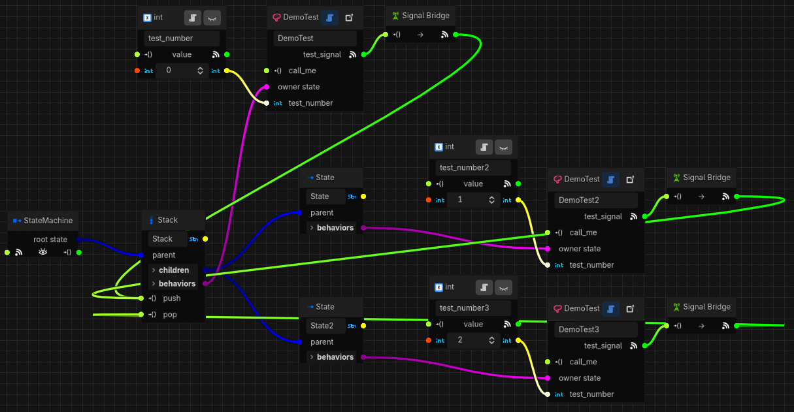

# Tutorial: Creating Custom States
Synapse provides a handful of states out-of-the-box, but sometimes you may want more control over
the state machine's flow. For that, you need to build a custom state. In this tutorial, we'll build
our own state type to illustrate the process.

##  The Stack State
Let's say we have a game where the player picks up powerups, and when picking up multiple powerups
of the same type the effects should stack up to some maximum number. If all we wanted to do is, say,
multiply the damage output of the player's weapon, we could do that trivially by just incrementing a
number. But, using a series of states allows us to trigger custom behaviors at each level of the
stack. For example, if we want to radically change what the powerup does like go from shooting
bullets, to lasers that pass through enemies, to explosions, etc.

Our stack state will follow a few strict rules:
1. The stack state will be the parent, and it tracks the current stack level.
1. The level can only change in increments of 1 ("push") and -1 ("pop"), and stays in the `0` —
`len(child_states)` range (inclusive).
1. At level 0, none of the child states are active. At level `L`, child states `1` through `L` are
active.

## Implementing the Scripts
Making a custom state involves two steps:
1. A custom implementation of `SynapseState`, the runtime representation of the state state, and
2. An accompanying implementation of `SynapseStateData`, the in-editor configuration of the state.

### Step 1: The State Script
The state script implements the runtime logic of our state. Create a new script that extends
`SynapseState` and has properties to keep track of the current level and child states, like so:

```gdscript
# Doesn't need to be a global class, but we're giving it a name so our data script can reference it
class_name StackState
extends SynapseState

var level := 0
var child_states: Array[SynapseState] = []
```

Pretty straightforward so far. Now, let's make a constructor that let's us set these properties as
well as the required parameters of the base class:

```gdscript
func _init(name: StringName, behaviors: Array[SynapseBehavior] = [], child_states: Array[SynapseState] = []) -> void:
	super(name, behaviors)
	self.child_states.append_array(child_states)
```

***Note:*** *If you have "Shadowed Variable" and/or "Shadowed Variable Base Class" warnings set to
error on in your project settings, you may need to add
`@warning_ignore("shadowed_variable", "shadowed_variable_base_class")` above the method definition.*

The base class constructor (invoked by the call to `super()`) accepts a `name` and a list of
behaviors, because every state must have a name and the editor allows us to add behaviors to any
state.

Next, we need to define the `push()` and `pop()` methods that will increase and decrease the level,
using `mini` and `maxi` to ensure that `level` stays within the intended range:

```gdscript
func push() -> void:
	level = mini(len(child_states), level + 1)

func pop() -> void:
	level = maxi(0, level - 1)
```

Now we get to the interesting part: entering and exiting the child states based on the value of
`level`. But, there's a catch: We need to take into account whether the stack state itself is
active. If it isn't, we shouldn't activate child states. First, we need to ensure that when our
stack state is entered and exited, we update the child states:

```gdscript
func enter() -> void:
	super() # always enter the parent state before the children
	for index in level:
		child_states[index].enter()

func exit() -> void:
	for index in level:
		child_states[index].exit()
	super() # always exit the parent state after the children
```

These methods *must* always call `super()` because the base class is responsible for setting the
state's `active` property, as well as suspending/unsuspending all the behaviors associated with our
stack state, which it does in the base method. Note the order of activation as indicated by the
comments- we never want a child state to be active while the parent state is not, so we always enter
the parent state before the children, and exit it after the children.

The `for` loop is a no-op if `level` is zero, but if it is non-zero it will run from zero to 
`level-1`. As an example, if `level=2` then we will enter and exit the first two child states (array
indexes `0` and `1`) when our stack state is entered.

Also, `enter()` and `exit()` should always be *idempotent*, meaning calling the same method multiple
times should be a no-op after the first call. Typically that means checking the `active` property
at the beginning of the method, but since we expect our child states' `enter()` and `exit()` methods
to also be idempotent we won't bother.

Managing the child states during `enter()` and `exit()` is only half the picture, though. What if
`push()` or `pop()` are called while our stack state is active? We need to update those methods to
ensure the correct child states are entered and exited when these methods are called, so let's
change them to:

```gdscript
func push() -> void:
	level = mini(len(child_states), level + 1)
	if active and level > 0:
		child_states[level - 1].enter()

func pop() -> void:
	level = maxi(0, level - 1)
	if active and len(child_states) > level:
		child_states[level].exit()
```

We can't just check the `active` property because we also need to cater to edge cases like when the
stack has no children, or `level` is zero, or the maximum. Off-by-one errors are tricky! Again, we
don't bother to try and avoid calling the child state's `enter()`/`exit()` multiple times because of
idempotency (to do that, we'd need to check what the level was before the `mini`/`maxi` call).

Another subtle detail to note here is that we don't just do nothing when `active` is false- we will
still update `level` - this is a design choice to ensure that we can build state machines that can
update the stack even while the stack state is inactive, for example if the character's powerup
stack state is inactive while our character rummages through a chest and the player collects a
powerup from the chest. But, if your game rules require the stack to strictly limit stack updates to
when the stack is active, you can just early out return from these methods if `active` is false.

Almost there! The last step is to ensure that our state can be saved and loaded, which in our case
simply means that we need to persist the value of our `level` property. The state machine allows us
to provide custom save data in the form of a dictionary. So, we'll just make a `&"level"` key to
hold the value (if your state has many keys, it's probably better to use constants than magic
strings!):

```gdscript
func get_save_data() -> Dictionary:
	return { &"level": level }

func load_save_data(save_data: Dictionary) -> void:
	level = save_data[&"level"]
```

That's all we need to do. However, be aware that parent states are always responsible for keeping
track of which of their child states are active when saving, and re-activating them when loading. In
our case `level` sufficiently represents the active child states, but to explain why we don't
explicitly activate the child states in `load_save_data()` we need to understand how the state
machine loading process works. When loading, the state machine will first exit its root state, and
once loading is complete it will then re-enter the root state if it was active before loading. Since
each parent state is responsible for managing its children, from the root the `enter()` calls will
"bubble down" to all the previously active states. This means our `enter()` method will always be
called if our stack state was active before loading, and our `enter()` method will enter all the
right child states for us.

With that, our state is complete! The full script is provided at the end of this tutorial in
[State Script](#state-script).

### Step 2: The State Data Script
The state data script stores the configuration of the state we create in the editor. It is a
`Resource` that gets saved with its owning state machine's data resource. It is also responsible for
interacting with the Synapse editor for things like drawing connections between children and
exposing methods and signals that other entities in the state machine can connect to. Let's first
start with the basics:

```gdscript
@tool # state data scripts must be tool scripts because they run in the editor
class_name StackStateData
extends SynapseStateData

func instantiate_state(_state_machine: SynapseStateMachine, child_states: Array[SynapseState], behaviors: Array[SynapseBehavior]) -> SynapseState:
	return StackState.new(name, behaviors, child_states)

func get_type_name() -> StringName:
	return &"Stack" # the name of our state in the editor

func get_type_icon() -> Texture2D:
	return load("res://addons/synapse/docs/tutorials/media/stack_state.svg")
```

In the preamble, note comment about `@tool` - without this, Godot won't allow the Synapse editor to
call the methods on this script.

The `instantiate_state()` method is what gets called at runtime to actually create the state. This
method is called by the state machine during its creation phase. The state machine will provide a
reference to itself, the child states belonging to the state being instantiated, and the behaviors
associated with it. All we have to do is return an instance of our state class by calling the
constructor we defined earlier. (We don't need to interact with the state machine itself at this
point, so we just prefix that parameter with an underscore ("`_`") so Godot knows we don't intend to
use it.)

The other two methods handle how our state is displayed in the editor. This comes down to a name and
an icon for our state's type. The icon is provided along with this tutorial, but you'll want to
create your own icons following the guidelines from
[Editor icons](https://docs.godotengine.org/en/stable/engine_details/editor/creating_icons.html) in
the Godot documentation for your own state types.

Next, we need to tell the editor that our state can have children, and any number of them, like so:

```gdscript
func get_max_child_count() -> int:
	return -1 # -1 means "infinity"

func get_configuration_warnings(_state_machine: SynapseStateMachine) -> Array[Dictionary]:
	var warnings: Array[Dictionary] = []
	if len(child_names) < 1:
		warnings.append({ ConfigurationWarningKey.TEXT: "Stack state needs at least one child" })
	return warnings
```

The second method just adds some validation- the warning will be shown when our stack state doesn't
have any children, because a sero-sized stack doesn't make a lot of sense.

Now there's only one missing piece before we can test our state, and that's telling the Synapse
editor about the `push()` and `pop()` methods. To do that, we add:

```gdscript
func get_callable_infos_for_signals(_state_machine: SynapseStateMachine) -> Array[Dictionary]:
	return [
		{ "name": "push", "args": [], "default_args": [] },
		{ "name": "pop", "args": [], "default_args": [] },
	]
```

The `get_callable_infos_for_signals()` method is called by the editor to discover the structure of
any methods that the *runtime* state (our `StackState` class) has that we want to expose for signals
to connect to. The returned array must match the format of
[Object.get_method_list](https://docs.godotengine.org/en/stable/classes/class_object.html#class-object-method-get-method-list)
(An easy way to figure out what to put here is to just print the output of that method when called
on our state from a test script.) Since neither method accepts arguments or returns anything, the
definitions are straightforward.

At this point, our state is functionally complete so you should be able to test it out. Create a
new scene, add a `SynapseStateMachine` to it, and drag the root state out. You should see "Stack"
in the resulting popup menu with our custom icon (If you don't see it in the menu, go back and
double check your code against the above snippets. It's easy to forget things like adding `@tool` or
providing a unique type name.)

For a simple test, we've set up a state machine with a stack as the root and two child states as
follows:

<p align="center">
  
</p>

Our stack has a `DemoTest` behavior that calls `push()` from its `test_signal` which is emitted
after one second. Similarly, our first state has a behavior that calls `push()` a second time. Our
second state has the same behavior, but it calls `pop()` instead. After setting the state names to
"root", "one", and "two", and wiring up the `test_number` parameters we can run the scene and after
about 3 seconds we'll have the following output:

```text
DemoTest (test_name='root'): unsuspended with test_number=0
DemoTest (test_name='root'): test_number is now 0
DemoTest (test_name='one'): unsuspended with test_number=1
DemoTest (test_name='one'): test_number is now 1
DemoTest (test_name='two'): unsuspended with test_number=2
DemoTest (test_name='two'): test_number is now 2
DemoTest (test_name='two'): suspended with test_number=2
```

This sequence shows that first our root node (stack state) is entered, then after one second our
first child state is entered (because of the call to `push()`), and then our second. Lastly, because
our second state calls `pop()` the second state itself is exited.

As a final touch, we can display transition links between the child states as a visual indicator of
the stack sequence. To do that, we first need some utility methods to manage the connections:

```gdscript
func delete_transition_connections(editor: SynapseStateMachineEditor) -> void:
	# delete all transitions between children
	for c in editor.find_connections_matching(_is_child_transition):
		editor.remove_connection(c)
	# remove the transition slots from all our child state graph nodes
	for child_state_name in child_names:
		editor.state_graph_nodes[child_state_name].remove_transitions_slot()

func _is_child_transition(c: SynapseStateMachineEditor.ConnectionProxy) -> bool:
	# a child transition is defined as a connection between the input and output ports of the
	# SLOT_TRANSITIONS slot, for any pair of state graph nodes that are our children
	# we match on either because in some cases this method will be called after a state is already
	# deleted
	return (c.from_graph_node is SynapseStateGraphNode\
				and c.from_slot == SynapseStateGraphNode.SLOT_TRANSITIONS\
				and child_names.has(c.from_graph_node.get_entity_name()))\
				or (c.to_graph_node is SynapseStateGraphNode\
						and c.to_slot == SynapseStateGraphNode.SLOT_TRANSITIONS\
						and child_names.has(c.to_graph_node.get_entity_name()))

func update_transition_connections(editor: SynapseStateMachineEditor) -> void:
	# start over- we'll re-create all the connections
	delete_transition_connections(editor)

	# add stack transition slots to all children, and keep track of their graph nodes
	var child_graph_nodes: Array[SynapseStateGraphNode] = []
	for child_state_name in child_names:
		var child_graph_node := editor.state_graph_nodes[child_state_name]
		child_graph_nodes.append(child_graph_node)

	# for each child graph node up to the second-to-last, add a connection to and from the next child
	if len(child_graph_nodes) >= 2:
		for i in len(child_graph_nodes) - 1:
			var from_node := child_graph_nodes[i]
			from_node.add_transitions_slot()
			var to_node := child_graph_nodes[i + 1]
			to_node.add_transitions_slot()
			editor.add_connection(SynapseStateMachineEditor.ConnectionProxy.of(from_node, SynapseStateGraphNode.SLOT_TRANSITIONS, to_node, SynapseStateGraphNode.SLOT_TRANSITIONS))
			editor.add_connection(SynapseStateMachineEditor.ConnectionProxy.of(to_node, SynapseStateGraphNode.SLOT_TRANSITIONS, from_node, SynapseStateGraphNode.SLOT_TRANSITIONS))
```

That's a mouthful! Go over the code line-by-line, using the comments to shed some light along the
way. In short, the above code just allows us to delete and re-create all the necessary transitions
between child state graph nodes. To keep things simple, we'll just re-create all the transitions
whenever our state's child states are updated. To do that, we need to handle a number of signals
that get emitted when the state machine is edited:

```gdscript
func prepare_in_editor(editor: SynapseStateMachineEditor) -> void:
	editor.state_machine.data.state_child_added.connect(_on_state_machine_data_state_child_added.bind(editor))
	editor.state_machine.data.state_child_removed.connect(_on_state_machine_data_state_child_removed.bind(editor))
	editor.state_machine.data.state_child_order_changed.connect(_on_state_machine_data_state_child_order_changed.bind(editor))

func teardown_in_editor(editor: SynapseStateMachineEditor, previous_data: SynapseStateMachineData) -> void:
	previous_data.state_child_added.disconnect(_on_state_machine_data_state_child_added.bind(editor))
	previous_data.state_child_removed.disconnect(_on_state_machine_data_state_child_removed.bind(editor))
	previous_data.state_child_order_changed.disconnect(_on_state_machine_data_state_child_order_changed.bind(editor))

func _on_state_machine_data_state_child_added(_child_state_data: SynapseStateData, parent_state_data: SynapseStateData, editor: SynapseStateMachineEditor) -> void:
	if parent_state_data.name == name:
		update_transition_connections(editor)

func _on_state_machine_data_state_child_removed(child_state_data: SynapseStateData, parent_state_data: SynapseStateData, editor: SynapseStateMachineEditor) -> void:
	if parent_state_data.name == name:
		update_transition_connections(editor)
		# we must remove the transition slot here because `update_transition_connections` only sees
		# our remaining children since this method is called *after* the child is removed
		editor.state_graph_nodes[child_state_data.name].remove_transitions_slot()

func _on_state_machine_data_state_child_order_changed(parent_state_data: SynapseStateData, editor: SynapseStateMachineEditor) -> void:
	if parent_state_data.name == name:
		update_transition_connections(editor)
```

The `prepare_in_editor()` and `teardown_in_editor()` methods are called by the editor when our state
is added to and removed from a state machine and they are the ideal place to connect and disconnect
signals. In our case, since we want to update the transitions between our state's child states, we
need to be told whenever our state's children are updated (adding, removing, and re-ordering).

In each method, we need to check whether the signal is being emitted for one of our children since
these signals are emitted for child state changes related to all parent states, not just our own.

If we got all that right, you should see the editor display the connections between the child states
(you may need to close and re-open the editor or the current scene to get the signal handlers to
connect). The full script is provided at the end of this tutorial in
[State Data Script](#state-data-script).

## Conclusion
In this tutorial we demonstrated how to build a new state that can be used in the Synapse editor.
While we covered a lot of ground, the Synapse editor provides many other functions. To learn more,
have a look at the class documentation for `SynapseState` and `SynapseStateData`. You can also
peruse the code for the built-in states:
* State scripts are called `*state.gd` in [scripts/state_machine](../../scripts/state_machine).
* State data scripts are called `*state_data.gd` under
[scripts/resource_types](../../scripts/resource_types).

## Complete Scripts

### State Script

```gdscript
class_name StackState
extends SynapseState

var level := 0
var child_states: Array[SynapseState] = []

@warning_ignore("shadowed_variable", "shadowed_variable_base_class")
func _init(name: StringName, behaviors: Array[SynapseBehavior] = [], child_states: Array[SynapseState] = []) -> void:
	super(name, behaviors)
	self.child_states.append_array(child_states)

func push() -> void:
	level = mini(len(child_states), level + 1)
	if active and level > 0:
		child_states[level - 1].enter()

func pop() -> void:
	level = maxi(0, level - 1)
	if active and len(child_states) > level:
		child_states[level].exit()

func enter() -> void:
	super() # always enter the parent state before the children
	for index in level:
		child_states[index].enter()

func exit() -> void:
	for index in level:
		child_states[index].exit()
	super() # always exit the parent state after the children

func get_save_data() -> Dictionary:
	return { &"level": level }

func load_save_data(save_data: Dictionary) -> void:
	level = save_data[&"level"]
```

### State Data Script

```gdscript
@tool # state data scripts must be tool scripts because they run in the editor
class_name StackStateData
extends SynapseStateData
func instantiate_state(_state_machine: SynapseStateMachine, child_states: Array[SynapseState], behaviors: Array[SynapseBehavior]) -> SynapseState:
	return StackState.new(name, behaviors, child_states)

func get_type_name() -> StringName:
	return &"Stack" # the name of our state in the editor

func get_type_icon() -> Texture2D:
	return load("res://addons/synapse/docs/tutorials/media/stack_state.svg")

func get_max_child_count() -> int:
	return -1 # -1 means "infinity"

func get_configuration_warnings(_state_machine: SynapseStateMachine) -> Array[Dictionary]:
	var warnings: Array[Dictionary] = []
	if len(child_names) < 1:
		warnings.append({ ConfigurationWarningKey.TEXT: "Stack state needs at least one child" })
	return warnings

func get_callable_infos_for_signals(_state_machine: SynapseStateMachine) -> Array[Dictionary]:
	return [
		{ "name": "push", "args": [], "default_args": [] },
		{ "name": "pop", "args": [], "default_args": [] },
	]

func prepare_in_editor(editor: SynapseStateMachineEditor) -> void:
	update_transition_connections(editor)
	editor.state_machine.data.state_child_added.connect(_on_state_machine_data_state_child_added.bind(editor))
	editor.state_machine.data.state_child_removed.connect(_on_state_machine_data_state_child_removed.bind(editor))
	editor.state_machine.data.state_child_order_changed.connect(_on_state_machine_data_state_child_order_changed.bind(editor))

func teardown_in_editor(editor: SynapseStateMachineEditor, previous_data: SynapseStateMachineData) -> void:
	delete_transition_connections(editor)
	previous_data.state_child_added.disconnect(_on_state_machine_data_state_child_added.bind(editor))
	previous_data.state_child_removed.disconnect(_on_state_machine_data_state_child_removed.bind(editor))
	previous_data.state_child_order_changed.disconnect(_on_state_machine_data_state_child_order_changed.bind(editor))

func _on_state_machine_data_state_child_added(_child_state_data: SynapseStateData, parent_state_data: SynapseStateData, editor: SynapseStateMachineEditor) -> void:
	if parent_state_data.name == name:
		update_transition_connections(editor)

func _on_state_machine_data_state_child_removed(child_state_data: SynapseStateData, parent_state_data: SynapseStateData, editor: SynapseStateMachineEditor) -> void:
	if parent_state_data.name == name:
		update_transition_connections(editor)
		# we must remove the transition slot here because `update_transition_connections` only sees
		# our remaining children since this method is called *after* the child is removed
		editor.state_graph_nodes[child_state_data.name].remove_transitions_slot()

func _on_state_machine_data_state_child_order_changed(parent_state_data: SynapseStateData, editor: SynapseStateMachineEditor) -> void:
	if parent_state_data.name == name:
		update_transition_connections(editor)

func delete_transition_connections(editor: SynapseStateMachineEditor) -> void:
	# delete all transitions between children
	for c in editor.find_connections_matching(_is_child_transition):
		editor.remove_connection(c)
	# remove the transition slots from all our child state graph nodes
	for child_state_name in child_names:
		editor.state_graph_nodes[child_state_name].remove_transitions_slot()

func _is_child_transition(c: SynapseStateMachineEditor.ConnectionProxy) -> bool:
	# a child transition is defined as a connection between the input and output ports of the
	# SLOT_TRANSITIONS slot, for any pair of state graph nodes that are our children
	# we match on either because in some cases this method will be called after a state is already
	# deleted
	return (c.from_graph_node is SynapseStateGraphNode\
				and c.from_slot == SynapseStateGraphNode.SLOT_TRANSITIONS\
				and child_names.has(c.from_graph_node.get_entity_name()))\
				or (c.to_graph_node is SynapseStateGraphNode\
						and c.to_slot == SynapseStateGraphNode.SLOT_TRANSITIONS\
						and child_names.has(c.to_graph_node.get_entity_name()))

func update_transition_connections(editor: SynapseStateMachineEditor) -> void:
	# start over- we'll re-create all the connections
	delete_transition_connections(editor)

	# add stack transition slots to all children, and keep track of their graph nodes
	var child_graph_nodes: Array[SynapseStateGraphNode] = []
	for child_state_name in child_names:
		var child_graph_node := editor.state_graph_nodes[child_state_name]
		child_graph_nodes.append(child_graph_node)

	# for each child graph node up to the second-to-last, add a connection to and from the next child
	if len(child_graph_nodes) >= 2:
		for i in len(child_graph_nodes) - 1:
			var from_node := child_graph_nodes[i]
			from_node.add_transitions_slot()
			var to_node := child_graph_nodes[i + 1]
			to_node.add_transitions_slot()
			editor.add_connection(SynapseStateMachineEditor.ConnectionProxy.of(from_node, SynapseStateGraphNode.SLOT_TRANSITIONS, to_node, SynapseStateGraphNode.SLOT_TRANSITIONS))
			editor.add_connection(SynapseStateMachineEditor.ConnectionProxy.of(to_node, SynapseStateGraphNode.SLOT_TRANSITIONS, from_node, SynapseStateGraphNode.SLOT_TRANSITIONS))
```

| [← Previous: Building a Complete Game](game.md) | [Tutorials](README.md)
| :--- | :---: |
